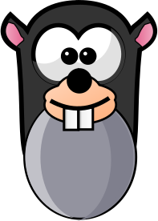

# 🔨 Whack-A-Mole

A polished, modern, and responsive **Whack-A-Mole** game built with Vanilla JavaScript, CSS3, and HTML5. This version enhances the classic gameplay with a challenging "Strict Combo" system, deep visual depth, and smooth interactive feedback.



## ✨ Features

-   **Polished UI/UX:** A clean, "nature-themed" aesthetic with deep shadows, realistic mole holes, and smooth CSS transitions.
-   **Strict Combo System:** Build your streak by hitting moles consecutively. Miss a mole or click the dirt, and your combo resets to zero!
-   **Adjustable Difficulty:** Choose between **Easy**, **Normal**, and **Hard** modes which adjust mole "peep" speed and game duration.
-   **Customizable Timer:** Fine-tune your game length using the integrated stepper controls.
-   **Dynamic Feedback:** Floating "+1" score indicators, screen shake on hits, and combo milestone pulses.
-   **Audio Feedback:** Integrated sound support for hits, misses, starts, and game over states.
-   **Full Mobile Support:** Fully responsive design that works seamlessly on desktops, tablets, and smartphones.
-   **High Score Persistence:** Your best score is saved locally, so you can always come back to beat your record.

## 🎮 How to Play

1.  **Set your level:** Select a difficulty (Easy, Normal, or Hard).
2.  **Set your time:** Use the `+` and `-` buttons to adjust the game duration.
3.  **Start:** Click the **Start Game** button.
4.  **Whack:** Click the moles as they pop up from the holes.
    -   **Hit:** Increases score and combo.
    -   **Miss:** Letting a mole disappear or clicking the dirt resets your combo.
5.  **Combo:** Reaching milestones (every 5 hits) gives extra visual feedback.
6.  **Pause/Restart:** Use the control buttons to manage your session.

## 🛠 Technologies Used

-   **HTML5:** Semantic structure and audio integration.
-   **CSS3:** Custom properties (variables), Grid, Flexbox, Animations, and Backdrop filters.
-   **JavaScript (ES6+):** Game logic, state management, and DOM manipulation.

## 🚀 Getting Started

To run this game locally:

1.  Clone the repository:
    ```bash
    git clone https://github.com/yourusername/whack-a-mole.git
    ```
2.  Open `index.html` in your favorite web browser.
3.  Enjoy the game!

